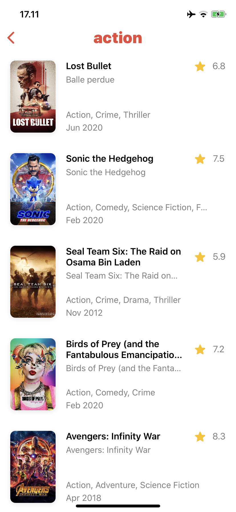

# movies
This is prove of concept about my MVVM Framework Experiment. iOS app to see information about movies based by themoviedb.org API

---
## What include in this project

- [x] My JSON Parser (Namada JSON)
- [x] MVVM Framework experiment

---
## Build Using

- Swift 5 and xcode 11.4

---
## Preview
### Screenshot

